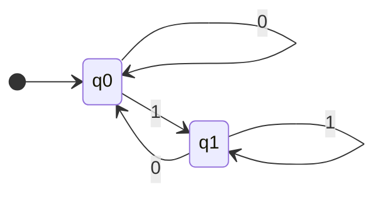
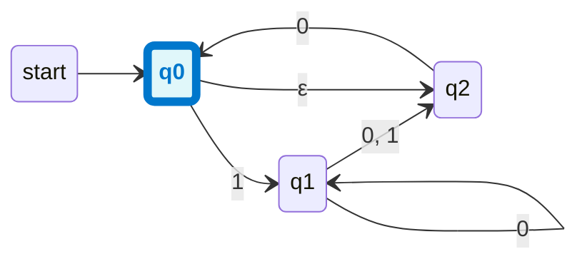
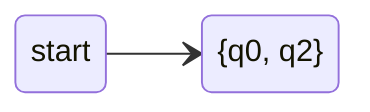
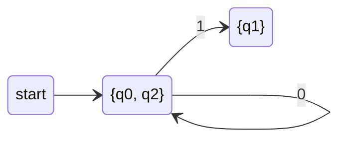
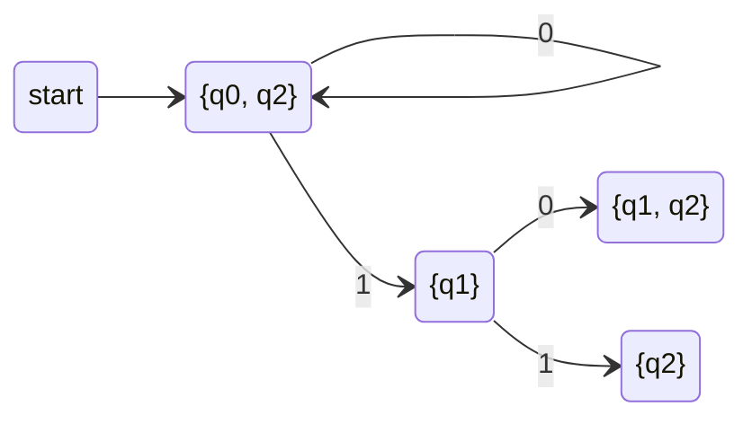
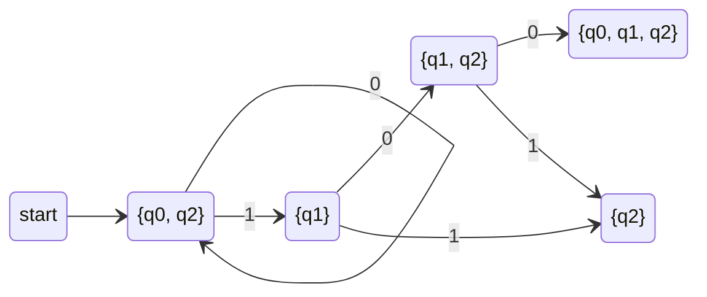
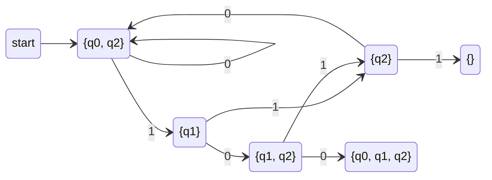
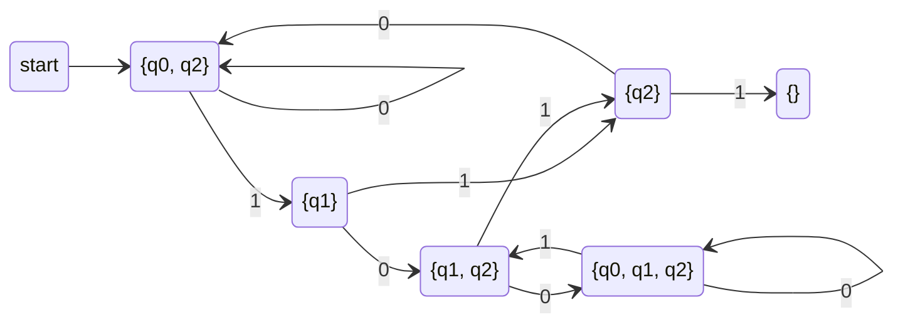
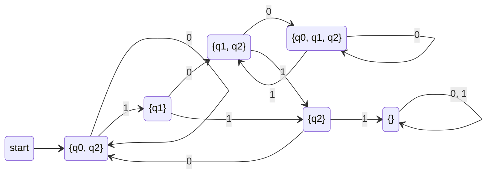
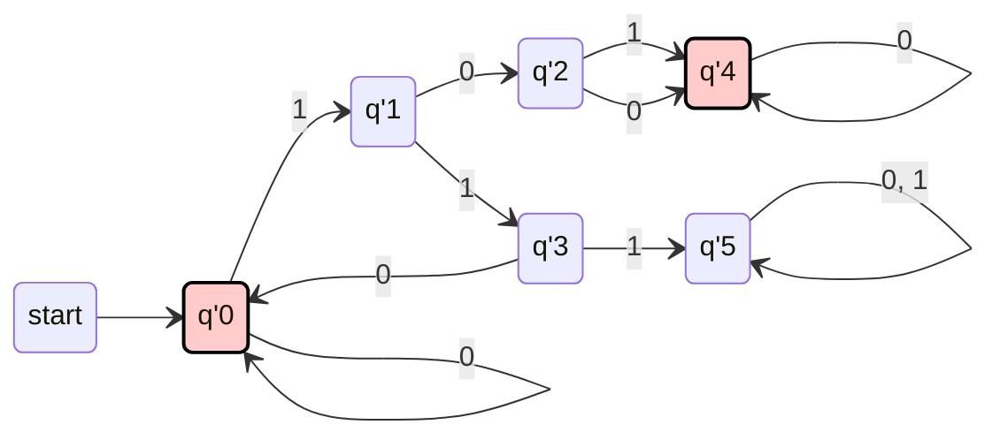

# TOC Finite Automata

The computation power of this model is rather weak. Because it can only use a limited (finite) memory. But it is also useful in some applications. 

## DFA

> [!info]+ Deterministic finite automata $DFA$
> A deterministic finite automata (DFA) is a 5-tuple  $(Q , \Sigma , \delta , q_{0}, F)$ , where
> - $Q$ is a finite set called **states**,
> - $\Sigma$ is a finite set called **alphabet**,
> - $\delta: Q \times \Sigma \rightarrow Q$ is the **transition function**,
> - $q_{0} \in Q$ is the **start state** (also called **initial state**), and 
> - $F \subseteq Q$ is the set of **accept states** (**final states**).


The transition function $\delta$ can also be represented as a **transition table**.
The table has $|Q|$ rows and $|\Sigma|$ columns.
The value in each entry is a state.
$\delta$ is a **total function**. So, every entry has a value.
The input of a DFA is a string in the language $\Sigma^*$.
The output of a DFA is only **accept** or **reject**.


Suppose $w = w_1w_2 \cdots w_n$ is a string in $\Sigma^*$. The DFA $M$ **accepts** $w$ if and only if:
  $$\delta(q_0, w_1) = q_{s_1}$$
  $$\delta(q_{s_1}, w_2) = q_{s_2}$$
  $$\vdots$$
  $$\delta(q_{s_{n-1}}, w_n) = q_{s_n} \in F$$

Each $q_{s_i}$ is a state of $M$.
Each $\delta(q_{s_i}, w_{i+1}) = q_{s_{i+1}}$ is a transition.
$q_{s_n}$ is a final state in $F$.

The sequence of transitions can also be expressed as:
  $$\delta(\cdots \delta(\delta(q_0, w_1), w_2) \cdots, w_n) \in F$$


Remember, a DFA can be represented as a **state graph**. The features of the graph are listed:

- A state is in a **circle**.
- A transition is an **arc** from the current state to the next state.
- The input symbol required by a transition is the **label** of the arc.
- The initial state is pointed by an **arrow**.
- Each final state is **double circled**.

**Example**

Let $M_1 = (\{q_0, q_1\}, \{0, 1\}, \delta, q_0, \{q_1\})$ be a DFA, where the transition function $\delta$ is:

|     | 0   | 1   |
|-----|-----|-----|
| $q_0$ | $q_0$ | $q_1$ |
| $q_1$ | $q_0$ | $q_1$ |





$$L(M_1) = \{ w \in \{0, 1\}^* \mid w \text{ end with 1's} \}.$$


If $A$ is the set of all strings that $M$ accepts, then:
   - $A$ is the **language of machine $M$**;
   - $L(M) = A$;
   - $M$ recognizes $A$.

   For example:
   $$L(M_1) = \{ w \mid w \text{ ends with a } 1 \}.$$

A language is **regular** if it is recognized by some DFA (Deterministic Finite Automaton).

## NFA 

> [!info]+ Nondeterministic finite automata $NFA$.
> An **NFA** (Nondeterministic Finite Automaton) is a 5-tuple $(Q, \Sigma, \delta, q_0, F)$, where:
> - $Q$ is the set of states;
> - $\Sigma$ is the alphabet;
> - $\delta : Q \times \Sigma \to \mathcal{P}(Q)$ is the transition function;
> - $q_0 \in Q$ is the start state; and
> - $F \subseteq Q$ is the set of final states.


Suppose $M$ is an NFA to **recognize** the language $A$.

- If $w$ is a string in the language $A$:
  - Then there **exists** a "way" to reach the final state;
  - It's also possible to reach a non-final state.

- But if $w$ is **not** a string in the language $A$:
  - Then there is **no way** to reach the final state.

**Please pay attention to the quantifiers.**


### Different between DFA and NFA

The difference between a DFA and an NFA is the transition function $\delta$.

- **DFA**: $\delta : Q \times \Sigma \to Q$
- **NFA**: $\delta : Q \times \Sigma \to \mathcal{P}(Q)$
  - $\mathcal{P}(Q)$ is the power set of $Q$.

This difference allows:
- One state to transition to zero, one, or multiple states by taking one input symbol.

### $ε-Moves$

Automatas can be further upgraded by a special transition.

> [!info]+ $\epsilon-Move$
> An **$\epsilon-Move$** is a transition from one state to another state by taking no input symbol.

Such automata is defined.

> [!info]+ NFA with $\epsilon-Move$	
>An **NFA with ε-moves** is the same as an NFA (without ε-moves) except the transition function:
>$$\delta : Q \times \Sigma \cup \{\varepsilon\} \to \mathcal{P}(Q)$$

Later, we will see that **ε-moves** allow us to recursively construct NFAs, which is... **elegant**.

## Equivalence of DFA and NFA

### Power

Let $\mathcal{M}_1$ and $\mathcal{M}_2$ be two computation models. $\mathcal{M}_1$ is as powerful as $\mathcal{M}_2$ if:

- For all languages $L$, $L$ is recognized by some machines in $\mathcal{M}_1$ if and only if it is recognized by some machines in $\mathcal{M}_2$.


$\mathcal{M}_1$ is more powerful than $\mathcal{M}_2$ if there is a language $L$ which can be recognized by some machines in $\mathcal{M}_1$ but no machine in $\mathcal{M}_2$.


**Note:** A computation model is a set of all machines of the same type.

> [!note]+  Theorem
> DFA, NFA, and NFA with $\varepsilon$-moves are of the same computation power.


For convenience, we denote the ordering on the power by $=_{\text{pow}}$, $<_{\text{pow}}$, $\leq_{\text{pow}}$, etc. Trivially,

> [!note]+  Lemma
>$$\text{DFA} \leq_{\text{pow}} \text{NFA} \leq_{\text{pow}} \text{NFA}_\varepsilon$$

Next, we only need to show $\text{NFA}_\varepsilon \leq_{\text{pow}} \text{DFA}$.


It seems the content repeats the explanation for converting $\text{NFA}_\varepsilon$ to a DFA and introduces the concept of $\varepsilon$-closure more formally. Here's a summary in Markdown format for your reference:


The Intuition of the Proof:
- For every $\text{NFA}_\varepsilon$, we can construct a **DFA** that recognizes the same language.
- This is equivalent to the process of converting an NFA to an equivalent DFA.


>[!note]+ Def:  $\varepsilon$-closure
>Let $N = (Q, \Sigma \cup \{\varepsilon\}, \delta, q_0, F)$ be an $\text{NFA}_\varepsilon$.  
>The $\varepsilon$-closure of a state $q$, denoted $E(q)$, is defined as:
>$$E(q) = \{q\} \cup \delta(q, \varepsilon) \cup \delta(\delta(q, \varepsilon), \varepsilon) \cup \dots$$

- $E(q)$ represents the set of all states that can be reached starting from $q$ **only using $\varepsilon$-transitions**.
- This closure includes $q$ itself and any other states reachable via one or more $\varepsilon$-moves.
- **Alternative Name**: The $\varepsilon$-closure is sometimes referred to as the **Kleene Star** or **Kleene Closure**.


> [!info]+ Def: $\upvarepsilon-Closure$ of a Set of States
>  Let $R$ be a set of states for a given NFA. The $\varepsilon$-closure of $R$, denoted $E(R)$, is:
> $$E(R) = \bigcup_{q \in R} E(q)$$

This means the $\varepsilon$-closure of $R$ is the union of the $\varepsilon$-closures of all individual states in $R$.
$E(q)$ is the set of states reachable from $q$ using only $\varepsilon$-transitions.

> [!info]+ Def: **$a$-Move of a Set of States:**
> Let $R$ be a set of states, and let $a$ be a symbol for a given NFA. The $a$-move of $R$, denoted $\delta(R, a)$, is:
$$\delta(R, a) = \bigcup_{q \in R} E(\delta(q, a))$$

 This describes all the states reachable by:
 1. First making an $a$-transition from any state $q$ in $R$, and
 2. Then taking all $\varepsilon$-transitions from those resulting states.

**NOTE:** $\delta(q, a)$ gives the set of states reachable by consuming the symbol $a$.


### Construction Algorithm

Let $N = (Q, \Sigma, \delta, q_0, F)$ be an $\text{NFA}_\varepsilon$. We construct a DFA $D = (Q', \Sigma, \delta', q_0', F')$, where:

- $Q' = \mathcal{P}(Q)$
- $\delta' : \mathcal{P}(Q) \times \Sigma \to \mathcal{P}(Q)$ such that:
  $$\delta'(R, a) = \{ q \in Q \mid \exists r \in R, q \in E(\delta(r, a)) \}$$
- $q_0' = E(q_0)$
- $F' = \{ R \in Q' \mid R \cap F \neq \emptyset \}$

---

**States ($Q'$):**

- $Q' = \mathcal{P}(Q)$, the power set of $Q$.
- Each state in $D$ is a subset of the states in $N$.

**Transition Function ($\delta'$):**

 $\delta' : \mathcal{P}(Q) \times \Sigma \to \mathcal{P}(Q)$, defined as:
       $$\delta'(R, a) = \{ q \in Q \mid \exists r \in R, q \in E(\delta(r, a)) \}$$

- For each state $R \subseteq Q$ and symbol $a \in \Sigma$:
- Find all states $q$ reachable by an $a$-move from some $r \in R$, considering $\varepsilon$-closures.

**Start State ($q_0'$):**

- $q_0' = E(q_0)$, the $\varepsilon$-closure of the initial state $q_0$ of $N$.

**Final States ($F'$):**

- $F' = \{ R \in Q' \mid R \cap F \neq \emptyset \}$.
- A subset $R$ of states is a final state in $D$ if it includes any final state of $N$.

Ensures $D$ captures all possible behaviors of $N$, including $\varepsilon$-transitions.
Uses the power set of $Q$ as the state space to simulate nondeterminism deterministically.

---

### Pseudocode

```pseudo
\begin{algorithm}
\caption{Convert NFA$_\varepsilon$ to DFA}
\begin{algorithmic}
    \State \textbf{Input:} An NFA$_\varepsilon$ $N = (Q, \Sigma, \delta, q_0, F)$
    \State \textbf{Output:} A DFA $D = (Q', \Sigma, \delta', q_0', F')$
    \State $Q' \gets \{E(q_0)\}$, $E(q_0)$ is unmarked, and $\delta' \gets \emptyset$
    \While{there exists an unmarked state $R \in Q'$}
        \State Mark $R$
        \For{each symbol $a \in \Sigma$}
            \State $U \gets E(\delta(R, a))$
            \If{$U \notin Q'$}
                \State Add $U$ to $Q'$
            \EndIf
            \State Add $\delta'(R, a) = U$ to $\delta'$
        \EndFor
    \EndWhile
    \State $q_0' \gets E(q_0)$
    \State $F' \gets \{R \mid R \text{ has a final state in } F\}$
    \State \Return $D \gets (Q', \Sigma, \delta', q_0', F')$
\end{algorithmic}
\end{algorithm}
```

### Example

Let’s try to convert this $NFA$ to $DFA$.




#### Initially


**Suppose the unmarked states are red.**  
$$Q' = \{E(q_0) = \{q_0, q_2\}\}, \quad \delta' = \{\}$$




#### Step 1

$E(\delta(\{q_0, q_2\}, 0)) = E(\{q_0\}) = \{q_0, q_2\}$
$E(\delta(\{q_0, q_2\}, 1)) = E(\{q_1\}) = \{q_1\}$



#### Step 2

$E(\delta(\{q_1\}, 0)) = E(\{q_1, q_2\}) = \{q_1, q_2\}$
 $E(\delta(\{q_1\}, 1)) = E(\{q_2\}) = \{q_2\}$



#### Step 3

$E(\delta(\{q_1, q_2\}, 0)) = E(\{q_0, q_1, q_2\}) = \{q_0, q_1, q_2\}$
$E(\delta(\{q_1, q_2\}, 1)) = E(\{q_2\}) = \{q_2\}$



#### Step 4

$E(\delta(\{q_2\}, 0)) = E(\{q_0\}) = \{q_0, q_2\}$
$E(\delta(\{q_2\}, 1)) = E(\{\}) = \{\}$



#### Step 5

$E(\delta(\{q_0, q_1, q_2\}, 0)) = E(\{q_0, q_1, q_2\}) = \{q_0, q_1, q_2\}$
$E(\delta(\{q_0, q_1, q_2\}, 1)) = E(\{q_1, q_2\}) = \{q_1, q_2\}$



$E(\delta(\{\}, 0)) = E(\{\}) = \{\}$
$E(\delta(\{\}, 1)) = E(\{\}) = \{\}$



#### Finally

$\{q_0, q_2\}$ and $\{q_0, q_1, q_2\}$ are final states.

Rename the states to make the DFA more readable and beautiful: $q'_0, q'_1, q'_2, q'_3, q'_4, q'_5$.



$q'_5$ is a trap state because it has no valid transitions.

