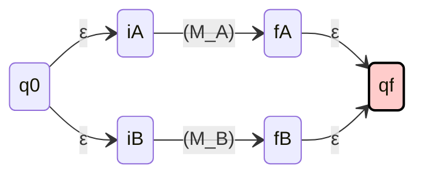
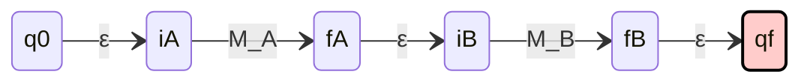
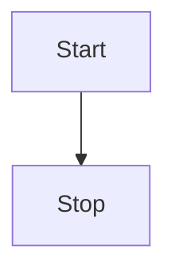
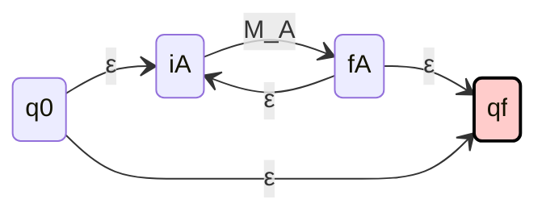

# TOC-Regular language

## Regular Language

> [!info]+ Def: regular language
> A language is regular if it is recognized by a DFA or an NFA.

To Prove a Language is regular, we need to construct a DFA or an NFA for the language.

### Regular Operations

> [!info]+ Def: Let $A$ and $B$ be languages.
>
> - Union : $A\cup B= {x|x\in A\ or\ x\in B}$
> - Concatenation: $A \circ B = \{ xy \mid x \in A \text{ and } y \in B \}$

#### Star

 $A^{*}=\{x_1x_2\dots x_k|k\geq 0\ and\ each\ x_i \in A\}$

**Note:**  each $x_i$ is a string in the language A. And $x_1 x_2\dots x_k$ is the concatenation of $x_1 , x_2$ , until $x_k$.
**Equivalently**, $A^∗ = A_0 \cup A_1 \cup A_2 \cup \dots$

> [!info]+ Def: Star operator
> Let $A$ be a language. 	$A^{n}$ for $n\in \mathbb{N}$ is recursively define
>
> - $A^{0} = \{\epsilon\}$
> - $A^{n} = A^{n-1}\circ A$
> - **$A^{*} = \cup_{i\in \mathbb{N}} A^{i}$**

#### Complement

Let $M = (Q, \Sigma, \delta, q_0, F)$ be an arbitrary DFA. And we construct a new DFA $M' = (Q, \Sigma, \delta, q_0, Q \setminus F)$. Prove that $L(\overline{M}) = L(M')$.

**Note:**  

- $Q \setminus F$ is the set difference.  
- $L(\overline{M}) = \Sigma^* \setminus L(M)$ is the set complement.

The goal $L(\overline{M}) = L(M')$ is understood as set equality.  
Thus, we need to prove $\forall w \in \Sigma^*$, $w \in L(\overline{M}) \iff w \in L(M')$.

($\Rightarrow$)  
Assume $w \in L(\overline{M})$.  
Then $w \notin L(M)$.  
Thus, DFA $M$ rejects $w$.  
In other words, DFA $M$ halts on a non-final state $q_x$ by consuming all symbols in $w$.  
By the construction of $M'$, $q_x$ is a final state of $M'$.  
Thus, $M'$ accepts $w$, and $w \in L(M')$.

---

($\Leftarrow$)  
Assume $w \in L(M')$.  
DFA $M'$ accepts $w$.  
In other words, DFA $M'$ halts on a final state $q_y$ by consuming all symbols in $w$.  
By the construction of $M'$, $q_y$ is a non-final state of $M$.  
Thus, $M$ rejects $w$, so $w \notin L(M)$.  
Thus, $w \in L(\overline{M})$.

$L(\overline{M}) = L(M')$.

---

Let $\Sigma = \{0, 1\}, \{A = \{00, 1\} \}, and\  B = \{10, 1\}$.

- $A \cup B = \{00, 1, 10\}$
- $A \circ B = \{0010, 001, 110, 11\}$
- $A^0 = \{\varepsilon\}$
- $A^1 = \{00, 1\}$
- $A^2 = \{0000, 001, 100, 11\}$
- $A^* = \{\varepsilon, 00, 1, 0000, 001, 100, 11, \dots\}$

## Closure

> [!tip]+  Theorem (Closure)
> Regular language is closed under union, concatenation, star and complement.

if A and B are two regular languages, then $A\cup B$, $A \circ B$, and $A^{*}$ are also regular languages.


### Construct an NFA for $A\cup B$.




### Construct an NFA for $A \circ B$.




### Construct an NFA for $A^{*}$.






## Regular Expression

Regular languages can be recursively constructed.
A regular expression describes the common pattern the strings in a regular language (machine independent).

> [!info]+ Def: Regular expression (Recursive Definition)
> $R$ is a regular expression over $\Sigma$ if $R$ is
> $(Base\ Case)$
>
> - $a$ for some $a \in \Sigma$,
> - $\epsilon$, or
> - $\emptyset$
>
> $(Recursion)$
>
> - $(R_1 \cup R_2)$, where $R_1$ and $R_2$ are regular expressions,
> - $R_1 \circ R_2$, where $R_1$ and $R_2$ are regular expressions, or
> - $R_1^{*}$, where $R_1$ is a regular expression.

### Languages Defined by Regular Expression

> [!info]+ Def: Let $R$ be a regular expression. The language $L(R)$ defined by $R$ is 	
> $Base\ case:$
>
> - $L(\emptyset) = \emptyset$,
> - $L(\epsilon) = \{\epsilon\}$,
> - $\forall a\in \Sigma$,  $L(a) = \{a\}$.
>
> $Recursion:$
>
> - if  $R=R_1\cup R_2$, then $L(R) = L(R_1)\cup L(R_2)$
> - if  $R=R_1\circ R_2$, then $L(R) = L(R_1)\circ L(R_2)$
> - if  $R=R_1^{*}$, then $L(R) = L(R_1)^{*}$

Example:

Suppose $\Sigma =\{0,1\}$. Describe the language defined by the following regular expressions in English.

- $0^{*}10^{*}$
- $\Sigma^{*}1\Sigma^{*}$
- $(0\cup\epsilon)(1\cup\epsilon)$
- $(\Sigma\Sigma)^{*}$
- $\Sigma^{*}\emptyset$   Match nothing

## Equivalence of Regular Expression and Finite Automata

> [!info]+ Theorem
> Regular expressions are equivalent to finite automata.

The proof has two steps.

1. The language defined by a regular expression can be recognized by a finite automaton.
2. The conversion is also doable vice versa.

The conversion from a regular expression to an NFA is trivially ensured by the closure property .
So, we only need to convert NFA to regular expressions.

### Conversion from NFA to Regular Expression

The Conversion requires generalized NFA, which is a special type of NFA.

Only one start state and one final state.
The start state is different from the final state.
The transition function is

- $\delta:(Q \setminus \{q_f\}) \times (Q \setminus \{q_0\})\rightarrow R$

Suppose $\delta(a,b)\rightarrow R$

- It means transition from $a$ to $b$ requires $R$.
- If the GNFA has only 2 states $q_0$ and $q_f$, then the label on the transition is the regular expression for the language.
- Thus, the conversion recursively merges states and transitions of the generalized NFA.

```pseudo
\begin{algorithm}
\caption{Convert NFA$_\varepsilon$ to 2-state gNFA}
\begin{algorithmic}
\Input An NFA $N = (Q, \Sigma, \delta, q_0, F)$
\Output A regular expression which defines $L(N)$
\STATE $N' \gets N$ // convert the domain and codomain of the transition function
\STATE $Q' \gets Q' \cup \{q_0', q_f'\}$
\STATE $\delta'(q_0', q_0) = \varepsilon$
\FORALL{$q \in F$}
    \STATE $\delta'(q, q_f') = \varepsilon$
\ENDFOR
\FORALL{state $q$ in $Q'$ except $q_0'$ and $q_f'$}
    \STATE $Q' \gets Q' \setminus \{q\}$
    \FORALL{state $q_i$ in $Q'$ except $q_f'$}
        \FORALL{state $q_j$ in $Q'$ except $q_0'$}
            \STATE \textbf{Suppose} $\delta'(q_i, q) = R_1$, $\delta'(q, q) = R_2$, $\delta'(q, q_j) = R_3$, and $\delta'(q_i, q_j) = R_4$
            \STATE $\delta'(q_i, q_j) = ((R_1)(R_2)^* R_3) \cup (R_4)$
        \ENDFOR
    \ENDFOR
\ENDFOR
\RETURN $\delta'(q_0', q_f')$
\end{algorithmic}
\end{algorithm}

```
