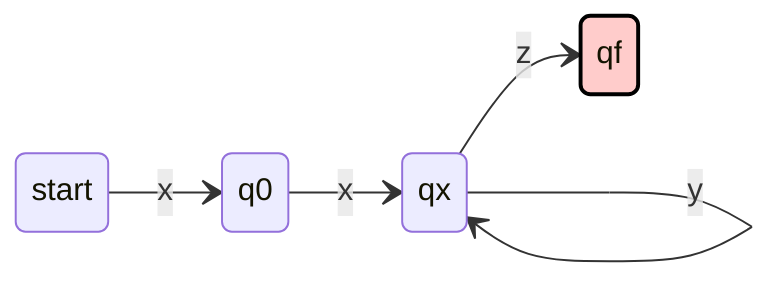

# TOC-Pumping Lemma

## Pumping Lemma

> [!abstract]+ Lemma (Pumping Lemma)
> If $A$ is a regular language, then there is a positive constant $p$ such that every string $w\in A$ of length at least $p$ can be written as $w=xyz$ satisfying the following conditions
>
> - for each $i\geq0, xy^{i}z \in A$
> - $|y| >0$, and
> - $|xy|\leq p$.

p is the *pumping length*.

Instead of proving the lemma formally, let's try to understand it.

Assume $A$ is regular and $N$ is the $NFA$ which recognizes $A$. 
Let $s$ be the number of states in $N$.

Assume $w$ in $A$ of length $|w|>s$.

To accept $w$, $N$ goes through a sequence of states $q_0,q_1,\dots,q_f$

By pigeonhole principle, some states $q_x$ appears multiple times in the sequence.

Assuming $w=xyz$, the sequence of states can be 

$$
\underbrace{q_0, \dots, q_x}_{\text{to accept } x}, \quad \underbrace{q_x, \dots, q_x}_{\text{to accept } y}, \quad \underbrace{\dots, q_f}_{\text{to accept } z}
$$

Then, it's trivial that $xz$, $xyz$, $xyyz$, $\dots$ are all in $A$.

The pumping lemma is used to prove a language is not regular.

### Proof language is not regular

To prove the language $A$ is not regular $(By Contradiction)$

- Assume that $A$ is regular.
- Construct a string $w\in A$ of length $|w|\geq p$.
- Show that no matter how $w$ is split into $xyz$, there is always an $i$ such that $xy^{i}z\not \in A$ (contradiction).

### Proof Example

> [!abstract]+ Theorem
> $L = \{ 0^n 1^n \mid \text{for some natural number } n \}$ is not regular.

**Proof:**

Assume $L$ is regular. Let $w = 0^p 1^p$, which is a string in $L$. By the pumping lemma, $w$ is in the form $xyz$. The substring $y$ can be of the following three cases.

1. **If $y$ only consists of $0$'s**, then $xyyz$ (pump $y$ one more time) has more $0$'s than $1$'s. Thus, $xyyz \notin L$.

2. **If $y$ only consists of $1$'s**, same as case 1.

3. **If $y$ has both $0$'s and $1$'s**, then $0$'s and $1$'s in $xyyz$ are intersecting with each other, which is not in the form of $0 \cdots 0 1 \cdots 1$. Thus, $xyyz \notin L$.

In summary, $w$ can never be split into $xyz$ such that $xy^i z \in L$ for all $i$. Thus, $L$ is not regular.

Here are some notes.

The pumping length $p$ depends on the machine. Different machines have different pumping length.

But the pumping lemma is "machine independent". Thus you cannot assume the value of $p$.

The condition $|y|>0$ ensures that the substring being pumped is not empty.
Otherwise, $xy^{i}z=xyz=xz$

The condition $|xy|\leq p$ ensures that $y$ always can be pumped by a machine.

The pumping lemma is only a necessary condition for regular.
It is not a sufficient condition.
In other words, if you cannot find a $w$ or such $w$ does not exist to accomplish the proof, you **CANNOT** say the language is regular. 

## Pumping lemma proof example

### $L_3 = \{ a^n \mid n \geq 2 \text{ and } n \text{ is a prime number} \}$.

**Answer:** Not regular.

**Proof:**

Assume $L_3$ is regular. Consider the string $a^c$, where $c$ is a prime number and $c > p$ (where $p$ is a constant from the pumping lemma). By definition, $a^c \in L_3$. 

Since prime numbers are infinite, $a^c$ is constructible for some $c > p$. (This point is crucial because, if $a^c$ were not constructible, the proof could not proceed.)

By the pumping lemma, $a^c$ can be split into three substrings $xyz$, where:
- $|xy| \leq p$,
- $|y| > 0$,
- $xy^iz \in L_3$ for all $i \geq 0$.

Here, $y$ consists of only $a$'s. Assume $|y| = d$. Then $|xz| = c - d$.

Now, consider the string $xy^{c+1}z$ (i.e., $xy^iz$ for $i = c+1$):
- Its length is $|xz| + (c+1)|y| = (c - d) + (c + 1)d = c(d + 1)$.

However, $c(d + 1)$ is **not a prime number**, because $c$ is a prime number, and $d + 1$ (where $d \geq 1$) is an integer greater than 1.

Thus, $xy^{c+1}z \notin L_3$, which contradicts the pumping lemma. Therefore, $L_3$ is **not regular**.

### $L_4 = \{ a^n \mid n \text{ is not a prime number} \}$.

**Answer:** Not regular.

**Proof (Sketch):**

We can express $L_4$ as:
$$L_4 = \Sigma^* \setminus (L_3 \cup \{\varepsilon, a\}) = \overline{L_3 \cup \{\varepsilon, a\}}.$$

- Here, $L_3 = \{ a^n \mid n \text{ is a prime number} \}$, and $\{\varepsilon, a\}$ are regular languages.
- Regular languages are closed under set union and complement.

If $L_4$ were regular, then $L_3$ would also be regular (by closure properties of regular languages). 
However, this contradicts the result from $L_3$, where $L_3$ was proven to be **not regular**.
Thus, $L_4$ is **not regular**.

### $L_6 = L_3^*$.

**Answer:** Regular. In fact, $L_6 = \Sigma^* \setminus \{a\}$.

**Proof:**

Consider $a^i$:

1. **Case 0:** If $i = 0$, then $a^0 = \varepsilon \in L_3^0$.
2. **Case 1:** If $i$ is a prime, then $a^i \in L_3$.
3. **Case 2:** If $i$ is composite, then $i = p_1^{c_1} \times p_2^{c_2} \times \cdots \times p_n^{c_n}$, where each $p_j$ is a prime and $c_j$ is a positive integer constant.

   - Next, $a^{p_j^{c_j}} \in L_3$ for all $j$.
   - Thus, $a^i \in L_3^{c_1} \circ L_3^{c_2} \circ \cdots \circ L_3^{c_n}$.

Thus, $a^i \in \Sigma^*$.

###  $L_7 = \{a^n b^n \mid n \geq 1\} \cup \{a^n b^m \mid n \geq 1, m \geq 1\}$

**Answer:** Regular. 

- $\{a^n b^n \mid n \geq 1\} \subseteq \{a^n b^m \mid n \geq 1, m \geq 1\}$.
- $\{a^n b^m \mid n \geq 1, m \geq 1\}$ is regular.

### $L_8 = \{a^n b^n \mid n \geq 1\} \cup \{a^n b^{n+2} \mid n \geq 1\}$

**Answer:** Not regular.

**Proof (Sketch):**

- Consider the string $a^p b^p$.
- Then, $xy^2 z \notin L_8$.
